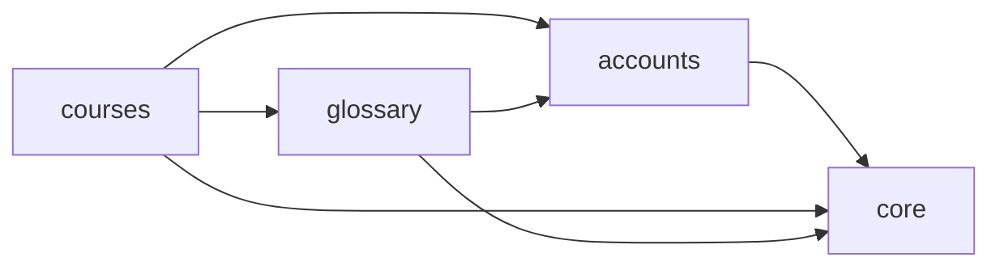

<!-- Generated by scripts/generate_documentation.py; do not edit. -->
# Generated application inventory

This reference is generated from the current SafeGloss Core repository.

## Component relationships

## Django applications

| Application | Models |
|---|---:|
| `accounts` | 1 |
| `core` | 2 |
| `courses` | 5 |
| `glossary` | 3 |

## Service modules

- `courses/access.py` — `active_exam_course_for_user`

## Management commands

- `seed_languages` (`core/management/commands/seed_languages.py`)
