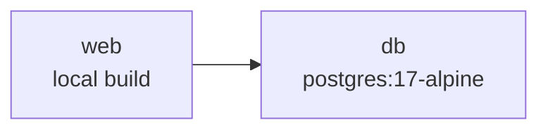

<!-- Generated by scripts/generate_documentation.py; do not edit. -->
# Generated deployment topology

These diagrams are generated from the Compose definitions committed to SafeGloss Core.
They do not assert that a particular environment is running or healthy.

## `compose.yaml`

| Service | Image/build | Depends on |
|---|---|---|
| `db` | `postgres:17-alpine` | — |
| `web` | `local build` | `db` |
