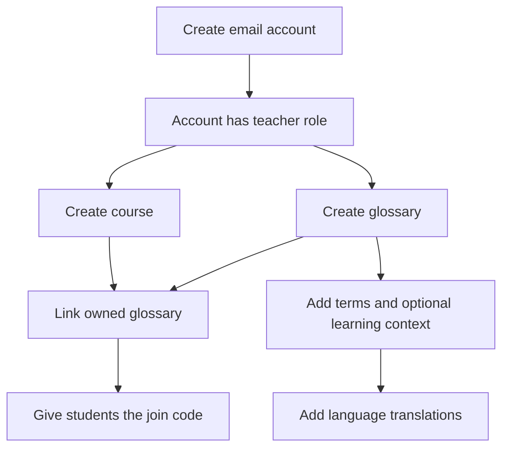
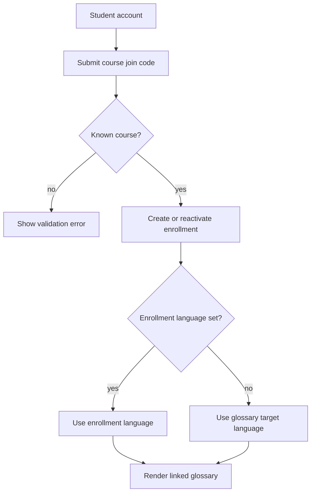

# SafeGloss Core product workflows

## People and responsibilities

| Actor | Responsibilities and capabilities |
|---|---|
| Student | Maintain an account and preferred language, join courses, and read linked glossary content allowed by the active course mode |
| Teacher | Create courses and glossaries, author terms and translations, organize rosters, link glossaries, and control Exam Mode for owned courses |
| Administrator | Use Django administration and staff-level read access where implemented; ordinary mutation views still enforce their explicit ownership queries |
| Hosting operator | Configure and deploy the service, run migrations, secure TLS and secrets, back up PostgreSQL, and verify health |

## Teacher onboarding and authoring

A teacher owns each created course and glossary. Course and glossary mutation
routes re-check that ownership on the server. Linking creates a unique
course/glossary association; it does not copy glossary content.

Teachers can import as many as 5,000 UTF-8 CSV rows in one transaction. The
`phrase` column is required. Existing phrases are updated, language codes must
exist, and an invalid row rolls back the complete import. CSV export prefixes
spreadsheet-formula-shaped values so opening the file does not execute them as
formulas.

## Student enrollment and language selection

Enrollment is unique per course and student. Rejoining reactivates an existing
enrollment. A student can view a course only while an active enrollment exists.

## Study Mode

Study Mode is the normal course state. For a linked glossary, an enrolled
student receives terms, translations in the selected language, definitions,
examples, and available pronunciation links. Teachers retain the same
authoring context regardless of course mode.

Public glossaries may appear in general glossary access, but course-specific
views still require access to the course and a link between the course and
glossary.

## Exam Mode

A teacher can activate Exam Mode manually, optionally with an expiry, or
schedule one or more time windows. A course is in Exam Mode when a non-expired
manual state or a currently active scheduled window exists. Returning to Study
Mode clears the manual state but does not delete schedules.

For an enrolled student during Exam Mode:

- general glossary navigation redirects toward the active exam course;
- glossaries outside that active course are rejected;
- unapproved terms are removed server-side; and
- the rendered table includes only term and selected-language translation,
  omitting definitions, examples, and pronunciation links.

Teachers are not restricted by their course's Exam Mode. If a student has more
than one simultaneously active exam course, the current implementation selects
the first active enrollment encountered; operators should avoid overlapping
exam windows for the same student until an explicit conflict policy exists.

Exam Mode is content restriction, not secure-browser enforcement. It cannot
block other applications, files, websites, screenshots, cameras, prior
downloads, or remembered information. See the
[security model](../development/SECURITY_MODEL.md).

## Print and exchange

Course glossary views are print-friendly. CSV is the supported bulk exchange
format. Core does not automatically call AI, analytics, email-delivery,
payment, roster-provider, or identity-provider services.

## Operator workflow

1. Supply production configuration and PostgreSQL.
2. Back up the database.
3. Build an immutable image from a reviewed tag.
4. Run Django's deployment check and migrations as controlled release steps.
5. Start the web process behind TLS.
6. Verify `/health/`, login, and an authorized glossary view.
7. Test database restores on an operator-defined schedule.

See the [deployment guide](../development/DEPLOYMENT.md) for the normative
release and rollback sequence.
